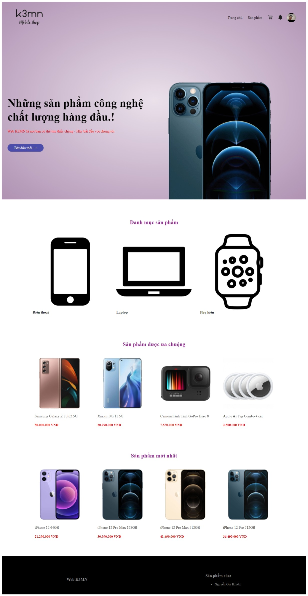
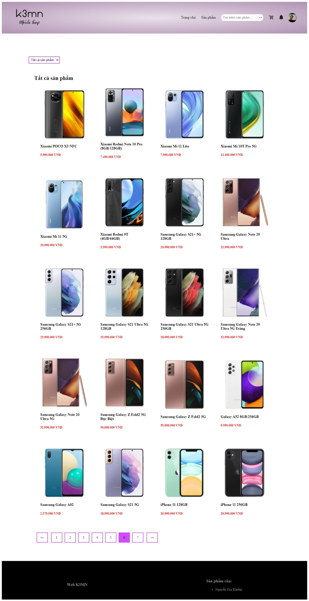

# K Shop e-commerce

This is a website to supports the online business of smartphones, laptops, digital devices, etc. The project was done during the internship period.

To launch the project, you have two ways to do it

1. Install and execute on local environment
2. Install and execute on Docker enviroment

>For the 2nd way, you need to switch to deploy-in-docker branch and follow the guide there.

This document is the installation and execution guide for the 1st way.

## Screenshots

<div>
  
  
</div>
---

## Prerequisites

Before you continue, make sure your computer has the following requirements installed:

<div>
  <a href="https://www.php.net/" target="_blank">
    
  </a>
  <p>PHP (prefer >= 7.3)</p>
  <a href="https://laravel.com/" target="_blank">
    
  </a>
  <p>Laravel (prefer v8.x)</p>
  <a href="https://getcomposer.org/" target="_blank">
    
  </a>
  <p>Composer (prefer >= v2.1.3)</p>
  <a href="https://nodejs.org/en/" target="_blank">
    
  </a>
  <p>NodeJs (prefer >= v14.x)</p>
  <a href="https://www.npmjs.com/" target="_blank">
    
  </a>
  <p>npm (prefer >= 6.x)</p>
  <a href="https://www.mysql.com/" target="_blank">
    
  </a>
  <p>MySQL (prefer >= 8.0)</p>
  <a href="https://redis.io/" target="_blank">
    
  </a>
  <p>Redis (prefer >= 3.0.x)</p>
</div>

**If you already have all the software above, let's get started!**

# Installation Guide

Clone project
```bash
git clone https://github.com/frankkhiem/thuc-tap-chuyen-nganh.git
```

Install dependencies
```bash
cd ./thuc-tap-chuyen-nganh/k_shop/
composer install
npm install
```

For the project database, it can be installed in two ways:

1. Use sample database  
    - Import files /sample_database/k3mn_shop.sql into mysql to create k3mn_shop database.
2. Create new database
    - Migration Laravel database
      ```bash
      php artisan migrate
      ```

    Project's database will be created. Will need to import new data manually.

Install laravel-echo-server
```bash
npm install -g laravel-echo-server
```

To start the project, run the following on different terminals:
```bash
php artisan serve
php artisan queue:work
npm run dev
laravel-echo-server start
```

Open browser with URL: http://127.0.0.1:8000

About the data import feature for administrator, the import template can be used in the directory /data_test_import 

## Let's experience this project 🙏 💪 🌟 🔥